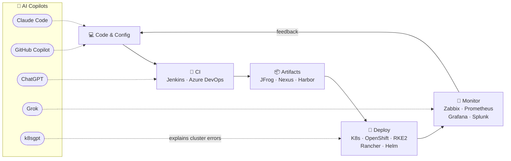

<div align="center">


<a href="https://github.com/adirangel">
  
</a>

<br/>


<a href="mailto:adirangel2@gmail.com">
  
</a>

</div>

## ⎈ whoami — as a Kubernetes manifest

```yaml
apiVersion: angel.adir/v1
kind: DevOpsEngineer
metadata:
  name: adir-angel
  age: 33          # <- auto-updated daily by GitHub Actions, I never touch it
  location: Israel
spec:
  education: B.Sc. Software Engineering
  mission: "Automate everything. Let AI handle the boring parts."
  expertise:
    - Kubernetes & OpenShift at scale
    - CI/CD pipelines end-to-end
    - Infrastructure as Code
  runsOn: [coffee, clean pipelines, self-healing infra]
  allergies: [manual work, snowflake servers, single points of failure]
  philosophy: "If it happens twice - automate it."
  aiPowered: true   # every pipeline ships with an AI copilot
status:
  phase: Running
  conditions:
    - type: OpenToInterestingProblems
      status: "True"
```

## 🤖 My AI-Augmented Pipeline

Every stage of my workflow has an AI copilot wired into it — from writing the pipeline to explaining why the cluster is on fire:



## 🧰 The Arsenal

<table>
  <tr>
    <td align="center"><b>🐳 Containers &amp; Orchestration</b></td>
    <td>
      
      
      
      
      
      
      
      
      
      
    </td>
  </tr>
  <tr>
    <td align="center"><b>🔁 CI/CD, SCM &amp; GitOps</b></td>
    <td>
      
      
      
      
      
      
    </td>
  </tr>
  <tr>
    <td align="center"><b>🏗️ IaC &amp; Config Mgmt</b></td>
    <td>
      
      
      
      
    </td>
  </tr>
  <tr>
    <td align="center"><b>📦 Artifacts &amp; Registries</b></td>
    <td>
      
      
      
      
    </td>
  </tr>
  <tr>
    <td align="center"><b>🐍 Languages &amp; Tooling</b></td>
    <td>
      
      
      
      
      
      
      
      
    </td>
  </tr>
  <tr>
    <td align="center"><b>📡 Monitoring &amp; Observability</b></td>
    <td>
      
      
      
      
    </td>
  </tr>
  <tr>
    <td align="center"><b>📨 Data &amp; Messaging</b></td>
    <td>
      
      
    </td>
  </tr>
  <tr>
    <td align="center"><b>🐧 OS &amp; Systems</b></td>
    <td>
      
      
      
      
      
      
    </td>
  </tr>
  <tr>
    <td align="center"><b>🌐 Networking &amp; Security</b></td>
    <td>
      
      
      
      
    </td>
  </tr>
  <tr>
    <td align="center"><b>☁️ Cloud &amp; Virtualization</b></td>
    <td>
      
      
      
    </td>
  </tr>
  <tr>
    <td align="center"><b>🤖 AI Stack</b></td>
    <td>
      
      
      
      
      
    </td>
  </tr>
</table>

## 🚀 Things I Built

Live products, in production, used every day — by me and anyone who signs up:

<table>
  <tr>
    <td align="center" width="230">
      <a href="https://xpcharging.vercel.app/"><b>⚡ XPCharging</b></a>
      <br/><br/>
      <a href="https://xpcharging.vercel.app/"></a>
      <br/><br/>
      <sub>
        
        
        
        
      </sub>
    </td>
    <td>
      Full-stack cost tracker for XPeng EV charging — log sessions, see monthly and yearly electricity spend, and export it all to Excel. Google OAuth sign-in on Supabase Auth, with seamless auto-migration for legacy bcrypt/JWT accounts. Bilingual EN/HE.
    </td>
  </tr>
  <tr>
    <td align="center" width="230">
      <a href="https://aiupdater.vercel.app/"><b>🤖 AIUpdater</b></a>
      <br/><br/>
      <a href="https://aiupdater.vercel.app/"></a>
      <br/><br/>
      <sub>
        
        
        
        
      </sub>
    </td>
    <td>
      A daily-refreshed AI intelligence hub: seven scheduled scrapers track model launches, coding-tool releases, docs changes and GitHub activity across Anthropic, OpenAI, Google, xAI &amp; DeepSeek — self-healing pipeline where one broken source never takes down the rest. Plus a catalog of ~1,800 AI repos sorted into 15 use-case categories and an auto-synced commands guide per tool. Bilingual EN/HE with full RTL.
    </td>
  </tr>
  <tr>
    <td align="center" width="230">
      <a href="https://github.com/adirangel/switch"><b>🖥️ ScreenSwitch</b></a>
      <br/><br/>
      <a href="https://github.com/adirangel/switch"></a>
      <br/>
      <a href="https://github.com/adirangel/switch/actions/workflows/build.yml"></a>
      <br/><br/>
      <sub>
        
        
        
        
      </sub>
    </td>
    <td>
      A software KVM in one keypress — Windows tray app that flips both monitors between two computers over DDC/CI, the same protocol behind the monitor's physical buttons. Global hotkey with a behavioral mid-game guard (detects fullscreen &amp; borderless games with no hardcoded list), headless CLI for Stream Deck bindings, and a single self-contained exe with zero runtime dependencies. Platform-neutral core, unit-tested on Linux CI.
    </td>
  </tr>
</table>

## 📊 Stats

<div align="center">


</div>

## 🐍 Contribution Snake

<div align="center">

<picture>
  <source media="(prefers-color-scheme: dark)" srcset="https://raw.githubusercontent.com/adirangel/adirangel/output/github-snake-dark.svg?v=1" />
  
</picture>

</div>

<div align="center">


</div>
