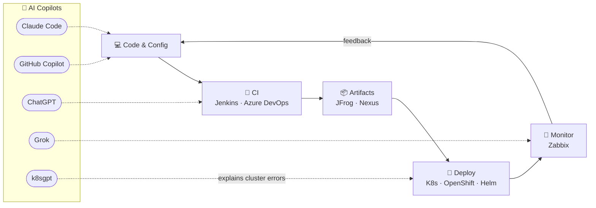

<div align="center">


<a href="https://github.com/adirangel">
  
</a>

<br/>


<a href="mailto:adirangel2@gmail.com">
  
</a>

</div>

## ⎈ whoami — as a Kubernetes manifest

```yaml
apiVersion: angel.adir/v1
kind: DevOpsEngineer
metadata:
  name: adir-angel
  age: 33          # <- auto-updated daily by GitHub Actions, I never touch it
  location: Israel
spec:
  education: B.Sc. Software Engineering
  mission: "Automate everything. Let AI handle the boring parts."
  currentlyLearning:
    - Terraform
    - Ansible
    - Docker Swarm
    - Azure DevOps
  aiPowered: true   # every pipeline ships with an AI copilot
status:
  phase: Running
  conditions:
    - type: OpenToInterestingProblems
      status: "True"
```

## 🤖 My AI-Augmented Pipeline

Every stage of my workflow has an AI copilot wired into it — from writing the pipeline to explaining why the cluster is on fire:



## 🧰 The Arsenal

<table>
  <tr>
    <td align="center"><b>🐳 Containers &amp; Orchestration</b></td>
    <td>
      
      
      
      
      
    </td>
  </tr>
  <tr>
    <td align="center"><b>🔁 CI / CD</b></td>
    <td>
      
      
      
    </td>
  </tr>
  <tr>
    <td align="center"><b>🏗️ IaC &amp; Config Mgmt</b></td>
    <td>
      
      
      
    </td>
  </tr>
  <tr>
    <td align="center"><b>📦 Artifacts &amp; Registries</b></td>
    <td>
      
      
    </td>
  </tr>
  <tr>
    <td align="center"><b>📡 Monitoring</b></td>
    <td>
      
    </td>
  </tr>
  <tr>
    <td align="center"><b>☁️ Cloud &amp; Infra</b></td>
    <td>
      
      
      
      
      
    </td>
  </tr>
  <tr>
    <td align="center"><b>🤖 AI Stack</b></td>
    <td>
      
      
      
      
      
    </td>
  </tr>
</table>

## 📊 Stats

<div align="center">

<picture>
  <source media="(prefers-color-scheme: dark)" srcset="https://github-readme-stats.vercel.app/api?username=adirangel&show_icons=true&theme=tokyonight&hide_border=true&bg_color=00000000" />
  
</picture>
<picture>
  <source media="(prefers-color-scheme: dark)" srcset="https://streak-stats.demolab.com?user=adirangel&theme=tokyonight&hide_border=true&background=00000000" />
  
</picture>

</div>

## 🐍 Contribution Snake

<div align="center">

<picture>
  <source media="(prefers-color-scheme: dark)" srcset="https://raw.githubusercontent.com/adirangel/adirangel/output/github-snake-dark.svg" />
  
</picture>

</div>

<div align="center">


</div>
